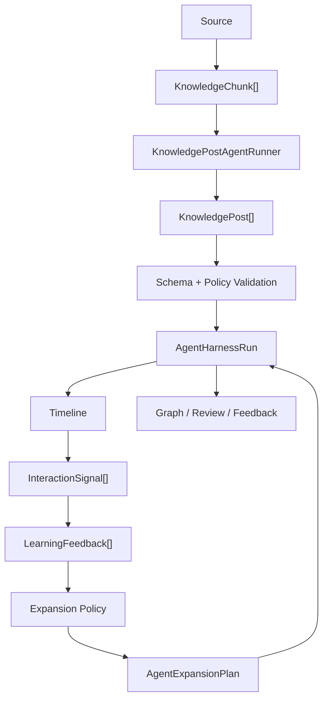

# Agent Harness v0

## Purpose

The Agent Harness is the product brain of AITimeline. It defines how an agent turns sources into timeline-native knowledge posts, how those posts expand into threads, how knowledge is stored as graph/review objects, and how interaction feedback changes the next agent run.

The harness exists so AITimeline does not become another generic:

- summarizer
- read-it-later app
- NotebookLM clone
- chat-with-documents workspace
- RSS digest

## Harness Contract

Every agent run should produce:

- `KnowledgePost`
- `KnowledgeThreadBlock[]`
- `KnowledgeGraphEdge[]`
- `KnowledgeReviewPrompt[]`
- `NextActionPolicy[]`

Code locations:

- [packages/core/src/types.ts](../packages/core/src/types.ts)
- [packages/core/src/harness/systemPrompt.ts](../packages/core/src/harness/systemPrompt.ts)
- [packages/core/src/harness/expansionPolicy.ts](../packages/core/src/harness/expansionPolicy.ts)
- [packages/core/src/harness/postHarness.ts](../packages/core/src/harness/postHarness.ts)
- [packages/core/src/harness/schema.ts](../packages/core/src/harness/schema.ts)
- [packages/core/src/harness/runner.ts](../packages/core/src/harness/runner.ts)
- [packages/core/src/harness/feedbackPolicy.ts](../packages/core/src/harness/feedbackPolicy.ts)

## Harness Run Architecture

The harness is now structured around a run contract instead of a single post factory.

Main contracts:

- `AgentHarnessConfig`: version, objective, runner kind, and policy limits.
- `AgentHarnessRunInput`: source, chunks, user context, and recommendation reason.
- `KnowledgePostAgentRunner`: shared interface for deterministic and future model-backed runners.
- `AgentHarnessRunResult`: generated posts plus validation metadata.
- `HarnessValidationResult`: schema and policy issues before posts enter timeline, graph, or review.
- `AgentExpansionPlan`: follow-up jobs, suppressions, and cooled topics after interaction feedback.

Current exported runners:

- `deterministicKnowledgePostRunner`
- `runDeterministicAgentHarness`
- `runAgentHarness`

This means future model-backed generation should implement `KnowledgePostAgentRunner` rather than bypassing the harness.

## Knowledge Post

A knowledge post is not a summary. It is a feed-native learning unit.

Required fields:

- `title`: concise and high-signal
- `hook`: the media-native reason to keep reading
- `thesis`: the one idea being taught
- `shortBody`: short timeline body
- `keyTakeaway`: one sentence worth remembering
- `sources` and `citations`: provenance
- `concepts`: stable graph node names
- `difficulty`: beginner / intermediate / advanced
- `confidence`: low / medium / high
- `thread`: expansion blocks
- `graphEdges`: concept relationships
- `reviewPrompts`: recall prompts
- `nextActions`: what the agent should do next

## Thread Blocks

Thread is not a comment section. Thread is the learning interaction layer.

Thread block kinds:

- `explain`: what this means
- `example`: concrete example
- `contrast`: how this differs from nearby ideas
- `extension`: where to go next
- `quiz`: quick recall check

## Feedback Policy

The recommender must interpret interaction, not just count it.

Signals:

- impression
- dwell time
- quick skip
- thread open
- like
- save
- ask question
- review completion

Inferred states:

- `interested`
- `confused`
- `fatigued`
- `not_relevant`
- `needs_review`

Next actions:

- `continue_deeper`
- `expand_broader`
- `reframe_simpler`
- `cooldown_topic`
- `schedule_review`
- `ask_clarifying_question`

## No-Interaction Rule

No interaction does not always mean no interest.

The harness should distinguish:

- quick skip: likely not relevant or fatigued
- long dwell without action: maybe useful but not emotionally strong
- thread open without ask/save: interest without explicit signal
- repeated skip in same topic: cool down
- prior interest in related concepts: reframe before dropping

The current expansion policy makes this explicit:

- cold impression with short dwell: suppress the series
- passive dwell below the soft-interest threshold: suppress the series
- long dwell without explicit action: queue a low-confidence deeper follow-up
- quick skip or high fatigue: queue topic cooldown
- topic already cooling down: suppress passive impressions

## Positive-Interaction Rule

Positive interaction decides expansion direction:

- Like: expand broader into adjacent concepts.
- Save: schedule review and strengthen graph memory.
- Ask: continue deeper or reframe simpler depending on the question.
- Thread dwell: continue the series, but vary depth and examples.
- Review completion: increase mastery and introduce the next concept.

The expansion job kinds are:

- `generate_followup`
- `schedule_review`
- `cooldown_topic`
- `ask_clarifying_question`

## Current Implementation

The current MVP uses a deterministic runner behind the same harness interface that a model runner will use:

1. A YouTube URL creates a mocked source and transcript.
2. Transcript segments become `KnowledgeChunk`s.
3. `runDeterministicAgentHarness` creates an `AgentHarnessRun`.
4. Each chunk becomes a validated `KnowledgePost`.
5. Each post includes hook, thread blocks, graph edges, review prompts, and next actions.
6. The transform result returns `cards`, `harnessRun`, and `validation`.
7. The Web app displays the post fields in the timeline and source detail drawer.
8. The Web app records lightweight interaction signals: impression, thread open, like, save, ask, and skip.
9. Signals are evaluated with `evaluateInteraction` and shown as feedback state plus next action.
10. `createExpansionPlan` turns recent signals and feedback into follow-up jobs, review jobs, suppressions, and topic cooldowns.

This is intentionally deterministic. The next step is to add a model-backed runner while keeping the same schema and validation gate.

## Build Next

1. Add dwell-time and viewport-based impression tracking instead of only action-based signals.
2. Add a model-backed `KnowledgePostAgentRunner` that takes source chunks and returns `KnowledgePost`.
3. Use validation failures to ask the model for repair before accepting a post.
4. Use `AgentExpansionPlan` jobs to trigger follow-up generation.
5. Persist topic cooldowns and expansion queue state.
