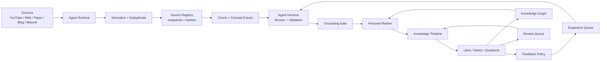

# Architecture

## High-Level Shape

## Open Core

`packages/core` contains portable logic:

- content and knowledge card types
- source, asset, chunk and citation types
- source registry, snapshots, hashes and chunk versions
- source and agent interfaces
- harness run, runner, grounding and validation contracts
- feedback expansion policy
- ranking primitives
- knowledge graph extraction
- review scheduling

The core should stay UI-agnostic and storage-agnostic so it can be reused by a CLI, self-hosted server, or commercial App backend.

## Hosted App

`apps/web` is the first commercial experience:

- timeline UI
- agent status
- card-level AI actions
- graph and review side rail
- pricing and entitlement hooks later

## Future Services

Later, the hosted product can split into:

- ingestion worker
- ranking service
- chat service
- graph service
- billing and entitlement service
- sync API

For MVP, keep it small. A single API service plus background jobs is enough.

## Source Transformation

Source transformation is the bridge between a NotebookLM-like source workspace and the timeline.

The first supported flow should be:

1. User imports a YouTube URL.
2. The system extracts metadata and transcript.
3. The system registers source assets as snapshots with content hashes.
4. The agent chunks the transcript into timestamped knowledge units.
5. The harness runner creates timeline-native knowledge posts with citations.
6. The harness validates post schema, policy and grounding before accepting output.
7. The cards enter ranking, graph and review systems.

The important product rule: transformed knowledge should not stay trapped in a source page. It should reappear in the user's timeline when it is useful.
