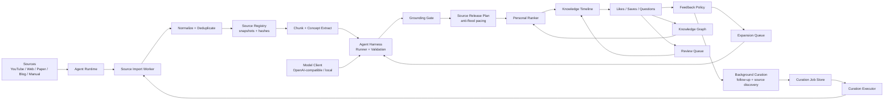

# Architecture

## High-Level Shape

## Open Core

`packages/core` contains portable logic:

- content and knowledge card types
- source, asset, chunk and citation types
- source registry, snapshots, hashes and chunk versions
- source and agent interfaces
- harness run, runner, grounding and validation contracts
- server-side model client adapters
- source import worker orchestration
- feedback expansion policy
- background curation planning
- background curation job queue and executor
- source post release pacing
- ranking primitives
- knowledge graph extraction
- review scheduling

The core should stay UI-agnostic and storage-agnostic so it can be reused by a CLI, self-hosted server, or commercial App backend.

## Hosted App

`apps/web` is the first commercial experience:

- timeline UI
- agent status
- card-level AI actions
- graph and review side rail
- pricing and entitlement hooks later

## Future Services

Later, the hosted product can split into:

- ingestion worker
- ranking service
- chat service
- graph service
- billing and entitlement service
- sync API

For MVP, keep it small. A single API service plus background jobs is enough.

## Background Curation

The app should not wait for the user to manually import every source. When a user shows interest in the timeline, the background agent can prepare the next learning material while the user keeps browsing.

The background loop is:

1. Timeline records interest signals such as long dwell, thread open, like, save, ask and review.
2. Feedback policy infers whether the user wants depth, breadth, a simpler reframe, review or cooldown.
3. Background curation creates jobs:
   - `generate_followup`: create the next post from the current topic.
   - `discover_sources`: search or receive external sources for the concepts.
   - `import_source`: send a selected external source to the source import worker.
   - `schedule_review`: convert interest into durable recall.
   - `cooldown_topic`: stop feeding a topic after skips or fatigue.
4. Curation job store persists queued jobs and exposes due jobs.
5. Curation executor runs configured handlers:
   - source discovery handler returns source candidates.
   - source ingestion handler turns a candidate into assets and chunks.
   - source import worker packages accepted sources into grounded posts.
6. Ranker decides when the packaged posts should re-enter the timeline.

The product rule is that background generation should feel alive, but bounded. Strong interest earns more depth and breadth. Weak or negative signals suppress the series instead of flooding the feed.

The core includes both an in-memory job store and a persistent store wrapper. The persistent wrapper stores a serialized queue snapshot through a small `read` / `write` adapter, so the hosted app can back it with a database or queue while local/self-hosted runtimes can use localStorage, a JSON file wrapper, or KV storage.

## Source Transformation

Source transformation is the bridge between a NotebookLM-like source workspace and the timeline.

The first supported flow should be:

1. User imports a YouTube URL.
2. The system extracts metadata and transcript from exposed caption tracks when available.
3. The system registers source assets as snapshots with content hashes.
4. The source import worker chunks the transcript into timestamped knowledge units.
5. A deterministic runner or model-backed runner creates timeline-native knowledge posts with citations.
6. The harness validates post schema, policy and grounding before accepting output.
7. The worker returns a `SourceImport` status artifact plus posts, registry, run and validation records.
8. The cards enter ranking, graph and review systems.

The important product rule: transformed knowledge should not stay trapped in a source page. It should reappear in the user's timeline when it is useful.

The current YouTube importer fetches the watch page, reads `ytInitialPlayerResponse`, selects a transcript track by language preference, fetches timedtext as JSON, then turns segments into source assets and timestamped chunks. Videos without exposed caption tracks should fail clearly and use a fallback transcript provider later.
