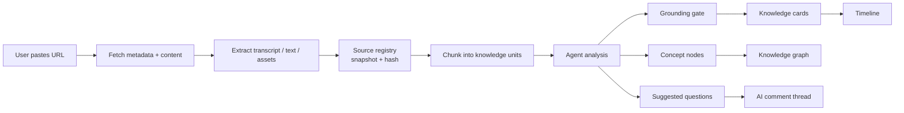

# Knowledge Transformation

## Product Idea

用户不只是消费 timeline，也可以把任意知识来源扔进来，让 agent 转化成适合自己学习的内容。

Example:

> 我有一个 YouTube 视频，我想让它出现在我的 timeline 里。

AITimeline 应该做的不是简单总结视频，而是把它变成一组可以被推荐、提问、复习和连入图谱的知识对象。

## Source To Timeline Flow



## Supported Source Types

MVP:

- YouTube URL with transcript.
- Web article URL.
- Manual text paste.

Next:

- PDF.
- Podcast or audio transcript.
- GitHub repo or README.
- Course notes.
- Book highlights.

## YouTube Transformation

Input:

- URL.
- title
- channel
- duration
- transcript with timestamps
- description

Agent outputs:

- 3 to 8 knowledge cards depending on video density.
- video-level summary.
- chapter summaries.
- concepts and relationships.
- claims that need citation.
- questions the user may want to ask.
- review prompts.

Each card should include:

- title
- summary
- key takeaway
- source timestamp range
- concepts
- recommended reason
- trust state

## NotebookLM-Like Grounding

NotebookLM is useful because answers are grounded in provided sources. AITimeline should keep that strength, but change the interface model:

- NotebookLM-like: source workspace, ask questions about a document set.
- AITimeline: personal feed where transformed source knowledge keeps resurfacing at the right time.

So the product should support:

- source-grounded answers
- citations
- timestamp backlinks
- source snapshots and content hashes
- claim-level grounding checks
- "show me where this came from"
- "turn this part into a review card"
- "connect this to what I already know"

## Transformation Quality Rules

- Never hide the source.
- Separate facts, interpretations and open questions.
- Reject source facts that cannot be grounded in registered chunks.
- Prefer multiple small cards over one huge summary.
- Extract concepts with stable names.
- Mark uncertain or contested claims.
- Preserve timestamp or paragraph citations.
- Make cards useful even when viewed days later.

## Data Objects Needed

```ts
type Source = {
  id: string;
  type: "youtube" | "article" | "pdf" | "manual";
  url?: string;
  title: string;
  author?: string;
  publishedAt?: string;
};

type SourceAsset = {
  id: string;
  sourceId: string;
  kind: "transcript" | "text" | "metadata";
  content: string;
};

type SourceSnapshot = {
  id: string;
  sourceId: string;
  assetId?: string;
  version: number;
  contentHash: string;
  contentLength: number;
};

type KnowledgeChunk = {
  id: string;
  sourceId: string;
  content: string;
  startTimeSeconds?: number;
  endTimeSeconds?: number;
};

type Citation = {
  sourceId: string;
  chunkId?: string;
  startTimeSeconds?: number;
  endTimeSeconds?: number;
  url?: string;
};

type GroundingCheck = {
  postId: string;
  valid: boolean;
  checks: Array<{
    fieldPath: string;
    status: "passed" | "warning" | "failed";
    overlapScore: number;
  }>;
};
```

## MVP Implementation Plan

Start with a mocked pipeline before real source integrations:

1. Add source object types in `packages/core`.
2. Add a transcript fixture.
3. Write a deterministic transcript-to-card transformer.
4. Add import UI with a pasted YouTube URL.
5. Show transformation status.
6. Inject generated cards into timeline.
7. Add a source detail drawer with citations.

This lets us test the product loop before fighting source availability, API limits and auth.

Current status:

- Steps 1 to 7 are implemented as a mocked Web prototype.
- The core now creates a source registry with source snapshots, content hashes, chunks and chunk versions.
- Harness validation now includes schema checks, policy checks and a first grounding gate.
- The core now includes a model-backed runner plus an OpenAI-compatible model client adapter for server-side import workers.
- The core now includes a source import worker that returns `SourceImport`, registry, posts, harness run and validation artifacts.
- The core now includes a real YouTube transcript fetcher for videos that expose caption tracks, plus a deterministic mock path for UI development.
- The core now includes an article URL importer that extracts metadata and readable paragraphs into text assets, chunks and cards.
- The prototype persists imported cards, source records, transcript chunks and AI threads in local storage.
- Videos without exposed transcripts still need a fallback path such as user-uploaded transcript text or a hosted extraction provider.
