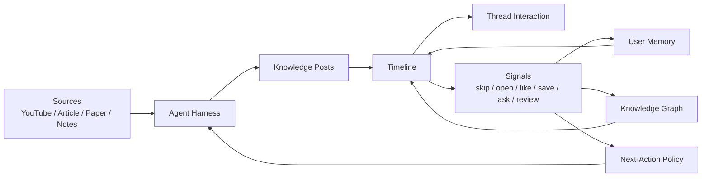

# Vision

## One-Line Vision

AITimeline is an open-core agentic knowledge media engine: users browse a timeline that feels like modern short-form media, but every post is source-grounded, graph-connected, and tuned to help them learn.

## Product Thesis

People already spend hours in feeds because feeds are frictionless, emotional, and continuously rewarding. Learning products usually fail because they ask users to manage libraries, folders, notes, and study plans.

AITimeline should invert that:

> Make learning feel like browsing, but make every interaction accumulate into memory.

The product is not a read-it-later app. It is not a NotebookLM clone. It is not a generic AI knowledge base.

It is a learning feed powered by an agent harness.

## Core Loop

## What The Agent Harness Does

The harness is the product brain. It tells agents how to:

- choose source material
- extract durable knowledge
- create a compelling post title and hook
- avoid shallow clickbait
- cite sources
- generate thread expansions
- extract concepts and edges
- produce review prompts
- update memory and graph
- decide whether to go deeper, broader, simpler, or stop

The open-source core should make this harness inspectable and configurable.

## Knowledge Post Philosophy

Each timeline item is not a summary. It is a knowledge post.

A knowledge post should have:

- a hook that makes the user want to keep reading
- a thesis that teaches one idea
- a source trail that makes the idea auditable
- concepts that connect it to the graph
- a thread that expands it
- review prompts that make it durable
- recommendation reasons that explain why it appeared

The post should feel alive enough to compete with social media, but grounded enough to avoid becoming AI-generated slop.

## Thread Philosophy

Thread is the second screen of learning.

When the user taps a post, the thread should help them:

- understand the idea
- see examples
- compare with adjacent ideas
- inspect source evidence
- ask questions
- generate a quiz
- connect it to saved knowledge
- request the next post in the sequence

Thread is not comments for social noise. Thread is the learning interaction layer.

## Recommendation Philosophy

The recommender should not optimize only for engagement. It should optimize for productive engagement.

Signals to track:

- impression
- dwell time
- quick skip
- thread open
- like
- save
- ask question
- review completion
- repeated confusion

Interpretation:

- No interaction can mean not interested, too hard, too easy, bad timing, weak hook, or fatigue.
- A like usually means interest.
- A save usually means retention value.
- A question usually means a knowledge gap.
- A thread open with long dwell usually means the topic has pull.
- Repeated skips mean cool down or reframe.

Next actions:

- continue deeper
- expand broader
- reframe simpler
- schedule review
- cool down topic
- ask clarifying question

## Product Promise

For users:

> Open the app, browse useful knowledge, ask when confused, save what matters, and gradually build a map of what you know.

For developers:

> Configure agents that transform sources into posts, threads, graph edges, and review prompts.

For the hosted app:

> We run the agents, sync the memory, manage AI usage, and make the learning feed feel effortless.

## Defensible Differentiation

The defensible system is not a model call. It is the combination of:

- source-grounded post generation
- media-native writing policy
- graph-aware memory
- interaction feedback
- next-action recommendation
- open-source harness
- commercial hosted convenience

Competitors may summarize content. AITimeline should learn how the user learns.

## Anti-Goals

- Do not become another generic RAG chat app.
- Do not become a folder-heavy PKM tool.
- Do not become a pure RSS reader.
- Do not become a social network before the learning loop works.
- Do not hide source provenance.
- Do not optimize for addictive noise.

## Short Brand Direction

Possible category names:

- Agentic Knowledge Media
- Learning Feed
- Knowledge Timeline
- Agentic Learning OS

Recommended first public phrasing:

> AITimeline turns sources into an addictive learning feed.

